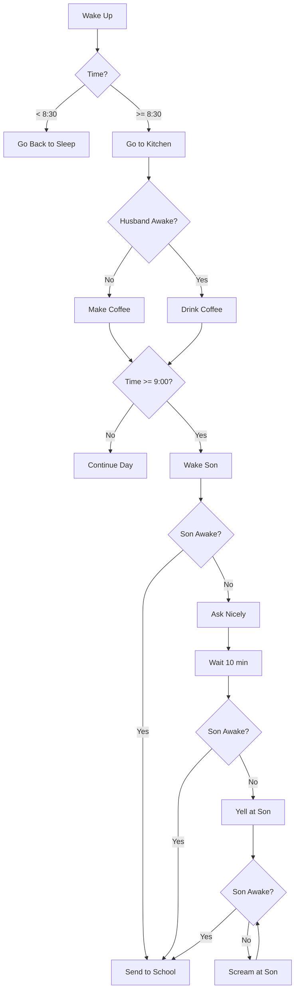

test1
=====

```mermaid
graph TD
    Start[Wake Up] --> CheckTime{Time?}
    CheckTime -->|< 8:30| Sleep[Go Back to Sleep]
    CheckTime -->|>= 8:30| Kitchen[Go to Kitchen]
    
    Kitchen --> CheckHusband{Husband Awake?}
    CheckHusband -->|No| MakeCoffee[Make Coffee]
    CheckHusband -->|Yes| DrinkCoffee[Drink Coffee]
    
    MakeCoffee --> CheckTime9{Time >= 9:00?}
    DrinkCoffee --> CheckTime9
    
    CheckTime9 -->|No| Continue[Continue Day]
    CheckTime9 -->|Yes| WakeSon[Wake Son]
    
    WakeSon --> SonResponse{Son Awake?}
    SonResponse -->|Yes| School[Send to School]
    SonResponse -->|No| AskNicely[Ask Nicely]
    
    AskNicely --> Wait[Wait 10 min]
    Wait --> SonResponse2{Son Awake?}
    SonResponse2 -->|Yes| School
    SonResponse2 -->|No| Yell[Yell at Son]
    
    Yell --> SonResponse3{Son Awake?}
    SonResponse3 -->|Yes| School
    SonResponse3 -->|No| Scream[Scream at Son]
    
    Scream --> SonResponse3
```
